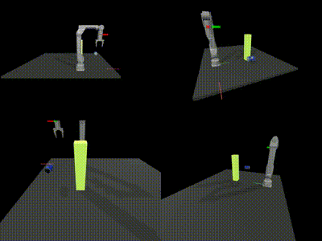
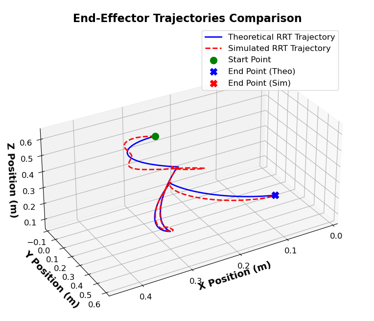

# RRT_Grasping_Path_Plannar_MuJoCo

This repo contains a MuJoCo environment for a robotic arm to generate a trajectory for grasping an object within the scene.

## Visualization

For better visualization, please git clone this repo and watch [rrt_robot_motion_demo.mp4](./rrt_robot_motion_demo.mp4)

The animation above demonstrates the robot's trajectory under theoretical calculation and simulations. Some subtle differences can be observed due to the fact that the manipulator has compliant joints, which cause response delays.

## Dependency
# Step 1: Create a Conda Environment
conda create -n act_a1 python=3.8.10
conda activate act_a1

# Step 2: Install Required Python Packages
pip install torch
pip install torchvision
pip install pyquaternion
pip install pyyaml
pip install rospkg
pip install pexpect
pip install mujoco==2.3.7
pip install dm_control==1.0.14
pip install opencv-python
pip install matplotlib
pip install packaging
pip install einops
pip install h5py
pip install ipython

